# Multi Class Binned Scatterplots (MCBS)

This plot is not meant to be used a replacement of the original scatterplot, but rather a special chart created to solve this particular problem:

***"With so many different colored small dots of scatterplot it is too difficult for me to understand the class distribution in this area of scatterplot."***

Initially, I tried to use MCBS to solve for overdraw in scatterplots but discovered that there are better existing solutions. Then I found out that MCBS serves a different purpose. Since it aggregates small scatterplot points into large glyphs -> it is really good at tasks related to analyzing class distributions:

- Finding Individual-Class Density Distribution
- Comparing the Density of 2 (or more) classes
- Finding Overall Point Density Distribution
- Finding part-to-whole ratio (Density of a class w.r.t. Overall Point Density)
- Identifying Outliers

These are discussed in further in *Section 2: Specific Use Cases*.

## Section 1: Novel Designs

Since, there was a scope and need of improvement of MCBS designs, I added two novel designs. Other than these two designs, there were more designs that I experimented with (you can find these in the "img" folder), but these two were finalized.

Throughout this README, you will be seeing many different versions of this original scatterplot based on the UCI Covertype Data Set:

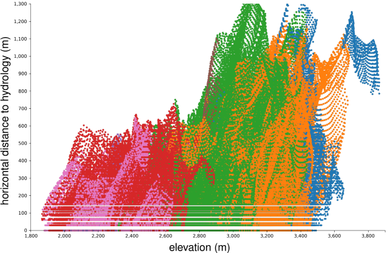

### Design 1: Streamwebs

Suppose, we had multi-class data in 1D and we need to analyze the class distribution across that 1 dimension. For this, we use stacked/overlapping area chart or streamgraph or something similar. But what about 2D?

#### Methodology: Design 1

- Divide the visual space in *few* vertical slices (slices parallel to y-axis).
- For each slice: the data can now be considered as along 1D (along y-axis in this case) and now the distribution can be visualized by a streamgraph for each slice.
- The width of each streamgraph is then scaled depending on the maximum width among all the streamgraphs.

Streagraphs are better for the design because it is along a centre line. The streamgraphs used can either be:

- normal stacked streamgraphs: good for part to whole visualization
- overlapping streamgraph (or overlapping violin charts): good for comparing frequency distrbution between the classes.

Another minor detail for the stacked streagraphs - a thin layer of padding between each class was added. This helps users to spot outliers. For example:

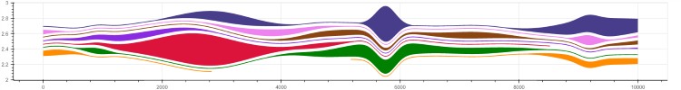

By using this method on UCI Covertype Dataset Example, we get:

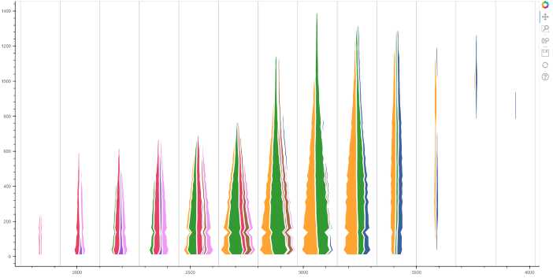

The slicing can also be done parallel to x-axis instead of y-axis. In our example, we get this:

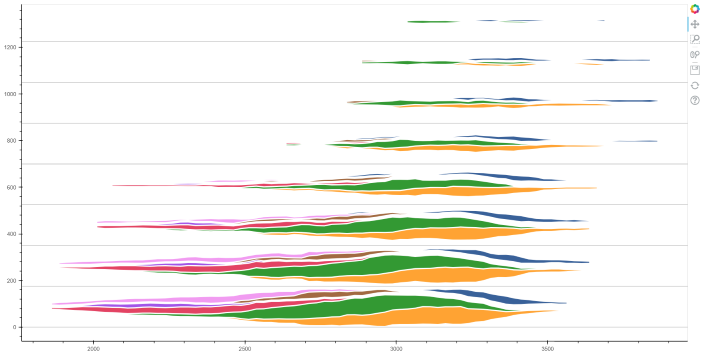

We can also superimpose the two and get the following plot:

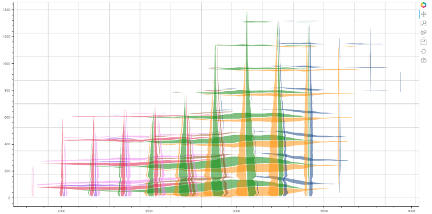

These designs are simple to understand and implement. Also, according to users' feedback, this design provided a "nice-way" of visualizing class distributions along the axes.

### Design 2: Scattered Bubbles Plot

One of the feedback on Design 1 was: "it didn't look like a scatterplot anymore", which is a legit concern. For this reason, this design was implemented.

Simple Description of this design: If in each bin of a scatterplot, all individual dots belonging to the same class combine to form multiple large non-overlapping bubbles with area of bubbles scaled according to the number of points it is "made" of. It is easier to understand class distribution with a few large bubbles than with thousands of individual dots belonging to different classes.

The design uses multiple large bubbles per class per bin instead of single large bubble for better space efficiency. If the space efficiency is low, the distinction between high-density and low-density region would diminish. This can be seen in the hand drawn sketch below:

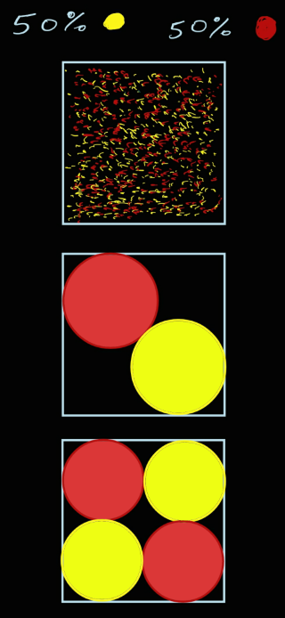

#### Methodology: Design 2

To explain the methodology, let us take an example of a bin. The bin content in percentages (w.r.t. Max bin frequency):

- Green: 48%
- Orange: 43%
- Brown: 0.5% (Outlier)
- Empty: 8.5% (This shows that frequency of this bin is 91.5% of max bin frequency)

By using a quad tree based approach the quantity and sizes of bubbles are determined. The possible range of resulting bubble size can be controlled by setting appropriate depth of quad tree. These bubbles are placed randomly for the visual impression that the bubbles of different classes are mixed togather in a bin and not present in isolated groups. The bin from the example is visualized as shown below:

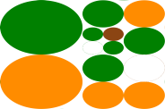

On visualizing the UCI covertype data set example with this approach, we get this:

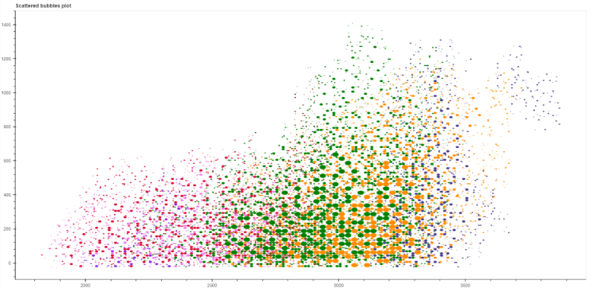

As you can see, this looks like a scatterplot. But, because of presence of bigger sized bubbles, it becomes easier to understand class distribution.

## Section 2: Specific Use Cases

We now discuss the specific use cases which:

- can provide additional insights from the data
- currently do not have any satisfactory solutions
- can be solved using MCBS.

### Use case 1: finding the localized class distribution of the entire 2D-space

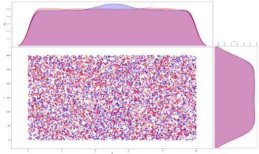

- In the scatterplot: the distribution of both classes seem to be uniform.
- The 1D Density plot along X-axis show a bump in the density of blue class for X values between 3 and 7.
- Question: *What range of Y caused the bump ?*

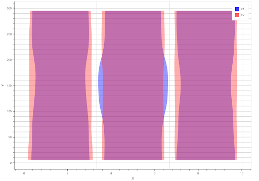

- Observation from MCBS (left): Y value range 90 to 210 caused the bump.
- Rectangles formed by the gridlines represent the bins. Binning grid approx. dimensions: 30x3 (30 rows, 3 columns)
- Scatterplots can be too specific - can identify only simple large changes in the distribution.
- 1D Density plots can be too abstract - not good for mapping distribution to the corresponding 2D subspace.
- MCBS with appropriate design can serve as the middleground.
- By changing the bin-size or slice-width, the user can select the required level of abstraction.

*Note: We could have used hexagonal-bin based designs too. Those are better are perceiving distribution trends along non-linear shapes. But for analyzing distribution along a line(or axis), this design works better as it gives continuous density plots.*

### Use case 2: finding the localized class distribution of only selected sub-space(s)

*This use case is not yet implemented. The pictures below are just for illustration purpose.*

#### 2a: The selected sub-space is rectangular and along a straight line

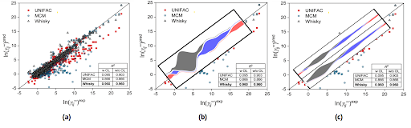

- As we see, in-place scatterplot binning made it easier for us to perceive distribution here.
- Fig. (b) shows the distribution along the longer side of rectangle. The user can also choose to visualize the distribution along the shorter side.
- In Fig.(c), we further divide the subspace to reduce the level of abstraction.

#### 2b: The selected sub-space(s) is of arbitary shape(s)

One of the reason why we need arbitary shape selection feature:

- For visualizing data with highly varying point density we often use subsampling or its variant.
- Suppose we need to analyze and compare the class density only in the lower point density regions present at corners of the 2D space (hence zooming in is not an option) - it becomes really difficult with the existing approaches.

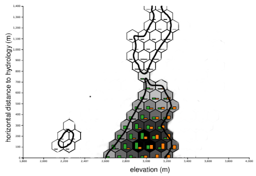

(Rough sketch of a modified version of Fig. 3(d) from the paper:
Heimerl F, Chang CC, Sarikaya A, Gleicher M. Visual designs for binned aggregation of multi-class scatterplots. arXiv preprint arXiv:1810.02445. 2018 Oct 4.)

- It can be made with the following steps:
  - User interactively marks the boundaries of the subspace(s).
  - Based on the bin size and shape, a binning over the selected area that covers the selected subspace(s) with minimum number of bins is computed.
  - Finally, we use an appropriate design to visualize the class distribution in each bin.
- The resulting class distribution is scaled according to the max point density of the bins in the selected subspace(s) only.
